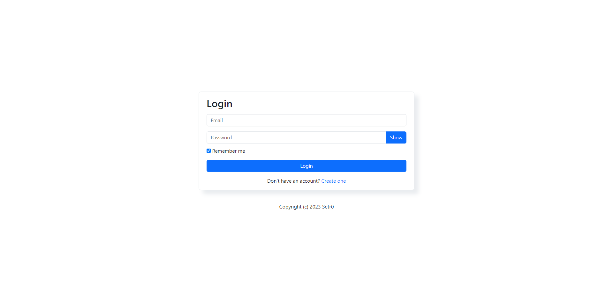
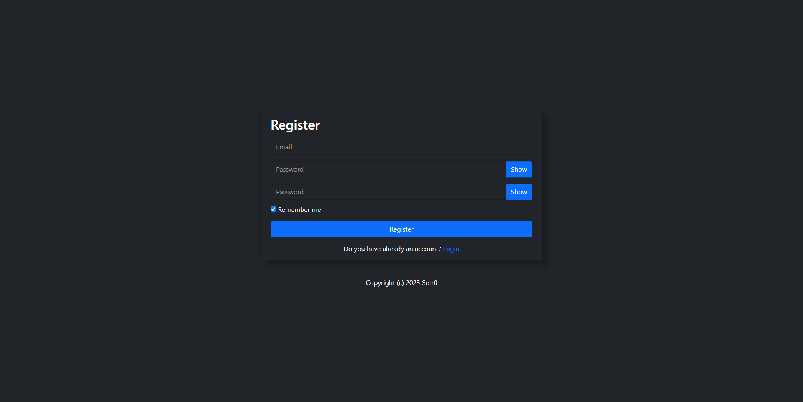
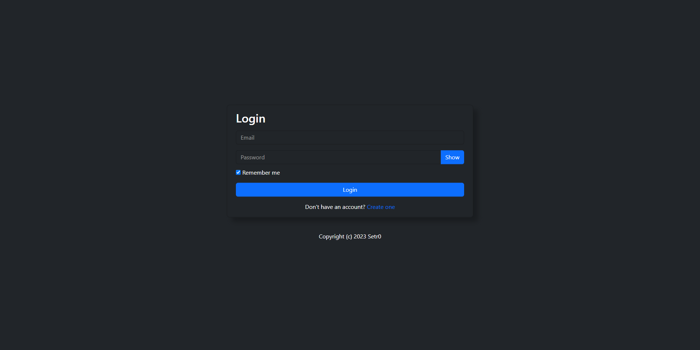

<h1 align="center">Login template</h1>

Login template made with Bootstrap

<h2>Features</h3>
<ul>
  <li>Responsive</li>
  <li>Light mode and Dark mode</li>
  <li>Easy to use</li>
</ul>

<h2>Tools</h3>
<ul>
  <li>Bootstrap</li>
</ul>

<h2>Images</h3>
<h3>Light mode</h4>

<h3>Dark mode</h4>

